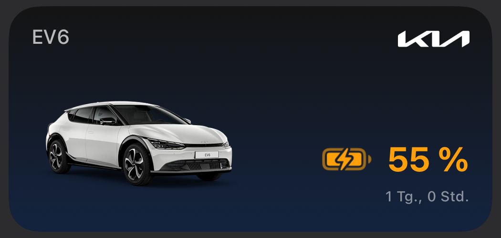

# Kia EV6 SoC iOS Medium Widget

This iOS medium widget displays the current state of charge (SoC) and the charging status of the Kia EV6.

<p float="left">
    
    
    
    
</p>

## Background

Since the official Kia Connect App does not support any kind of widgets for iOS, I gladly found Niklas Vieth development for the Polestart 2. With the help of [Scriptable](https://scriptable.app/) and his installation guide it was easily changeable. The widget relies on the [Tibber GraphQL API](https://developer.tibber.com/docs/overview) as a proxy to get the current state of charge of the battery. Thus, you will also need a Tibber account to get access to the SoC data.

## Prerequisites

1. Free Tibber Account with configured Polestar Power-Up
    > :warning: You **don't** need an electricity contract, you can just proceed with the free account.
    - Install [Tibber App](https://apps.apple.com/de/app/tibber-%C3%B6kostrom/id1127805969) on your iPhone and follow the registration instructions. Make sure to remember the email & password used to create the Tibber account.
    - [Configure Polestar Power-Up](https://support.tibber.com/en/articles/6675026-smart-charge-your-polestar-with-tibber#:~:text=How%20do%20I%20connect%20my%20Polestar%20to%20Tibber%3F)
2. Install [Scriptable](https://apps.apple.com/de/app/scriptable/id1405459188) on your iPhone
3. [Optional but recommended] Follow the [ScriptDude installation steps](https://scriptdu.de/#installation)

## Installation

1. Make sure you have followed all mandatory steps described in [Prerequisites](./README.md#Prerequisites).

2. There are two options to install the widget:
    - [Recommended] Click on the following button to install via `ScriptDude` (make sure that you have followed step 3 of [Prerequisites](./README.md#Prerequisites)). ScriptDude will automatically receive updates of new versions of this widget

        [](https://scriptdu.de/?name=Kia+Medium+Widget&source=https%3A%2F%2Fgist.github.com%2FThatIsEpic%2F3306871318f121b3642e8f8845c5d574%23file-kia-medium-widget-js&docs=#generator)

    - Copy the content of [kia-medium-widget.js](https://gist.github.com/ThatIsEpic/3306871318f121b3642e8f8845c5d574#file-kia-medium-widget-js), create a new script in `Scriptable`, paste the content and rename it to `Kia Medium SoC Widget`.

3. Replace the placeholder values for `<TIBBER_EMAIL>` and `<TIBBER_PASSWORD>` with your Tibber login credentials.
    > :warning: Make sure to remove the placeholder characters `<` `>` as well.

    ```js
    // Config
    const TIBBER_EMAIL = "<EMAIL_ADDRESS>";
    const TIBBER_PASSWORD = "<PASSWORD>";
    ```

4. [Optional] You can decide if you prefer the relative live counter or the absolute timestamp for the last seen date in the widget footer. Default is the relative format. Change the value to `false` if you prefer the absolute date.

    ```js
    const LAST_SEEN_RELATIVE_DATE = true;
    ```

5. Add the medium `Scriptable` widget to your homescreen. See [Apple How-To guide](https://support.apple.com/en-us/HT207122#:~:text=How%20to%20add%20widgets%20to%20your%20Home%20Screen).

    

6. Tap on the widget to configure the widget. Select `Kia Medium SoC Widget` as script, leave everything else blank.

7. You should now be able to see the :battery: SoC of your Kia on you homescreen. By clicking on the widget you will be navigated to the Kia Connect App.

8. [Optional] Mac users: You can even add the widget to you your Desktop or Notification Center if you have followed the above steps on you iPhone (see [Apple How-To Guide](https://support.apple.com/en-al/guide/mac-help/mchl52be5da5/mac#:~:text=Use%20iPhone%20widgets%20on%20your%20Mac)).

## Additional comments

There might be a minor lag or difference of the SoC compared to value displayed in the Kia Connect App because of the following reasons:

- The widget is relying on the Tibber API which syncs regularly with the actual Kia API.
- The refresh interval of the widget is determined by iOS itself.

### Appreciation

- Thanks @niklasvieth for developing the [Polestar-iOS-Medium-Widget](https://github.com/niklasvieth/polestar-ios-medium-widget).
- Thanks @simonbs for the awesome [Scriptable](https://scriptable.app/) app.

### Support

Since I am reusing Niklas' application, I would ask you to support him for his efforts.
<br>
<a href="https://www.paypal.me/niklasvieth" >
  
</a>
